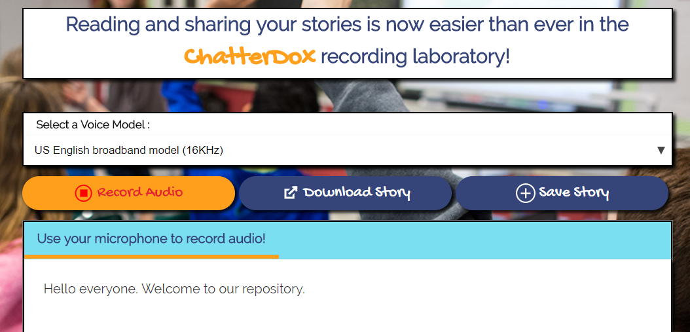

# ChatterDoX



Speech to text browser application designed to be used for children's reading lab lessons during school and at home. Students can record themselves reading stories out loud to practice literacy skills. Their speech is converted to written text and displayed on the screen in real time. The app provides a story management system for students to read and edit their recorded stories for further practice. Stories can be downloaded to their local device or saved to a database to be reviewed on the site's My Stories page. From this page students are given the options to delete unwanted stories, save them to their GoogleDrive accounts, or email them to a specified recipient.

The Watson Speech to Text API converts audio voice into written text. This Speech to Text service uses IBM's speech recognition capabilities to convert speech in multiple languages into text. The transcription of incoming audio is continuously sent back to the client via JSON objects with minimal delay, and it is corrected as more speech is heard. The service is accessed via a WebSocket interface; a REST HTTP interface is also available. Node.js is also used to provide the browser client's authentication token.

View on Heroku:
https://pure-caverns-32781.herokuapp.com/


## Run the App Locally

First clone this repository:
```
https://github.com/peraltot/Project-3-Speech.git
```

### Prerequisites:
#### Node.js and npm
Go to the Node.js site:  https://nodejs.org/en. Click the download button, and run through the installation file.
To check if you already have Node.js installed, run this command in your terminal:
```
node -v
```
To confirm that you have npm installed you can run this command in your terminal:
```
npm -v
```
#### MongoDB
You will need MongoDB to access our document data models. Visit https://docs.mongodb.com/manual/installation/ to run through the installation.
To test whether the installation was successful enter the following command in your command-line shell:
```
mongod --version
 ```

### Installing Node Packages:
In the terminal execute the following command:
```
npm install
```
This will install all of the app's node module dependencies.

### DB info:

Run `mongod` in a Terminal session:
Run `mongo` in a seperate Terminal session 

First remove the db so it can be re-created auto within our app

use Stories = will display (switched to db Stories)
db.dropDatabase(); = { "dropped" : "Stories", "ok" : 1 }

In the teriminal run `yarn start` which runs the script inside the start field of the script field in package.json
  
----

### Directory structure
```none
.
├── app.js                      // React Router
├── config                      // Express configuration
│   ├── express.js
│   └── security.js
├── models                      // Mongoose schema defined here for the Mongo db
├── routes                      // Api routes
├── manifest.yml
├── package.json
├── public                      // Static resources
├── server.js                   // Entry point
├── test                        // Tests
└── views                       // Watson react components
│   └── layout.js               // Main file - includes cdn libraries, stylesheets, javascript files
└── src                         // React components
```

----


## License

  Sample code is licensed under Apache 2.0.
  
## Authors

* Tom Peralto (https://github.com/peraltot)
* Emma Pankey (https://github.com/emmapankey)
* Louise Hayes (https://github.com/louise-hayes)
* Mike Sherman (https://github.com/msherman83)
* Connor Melnick (https://github.com/connorjohnmelnick)
